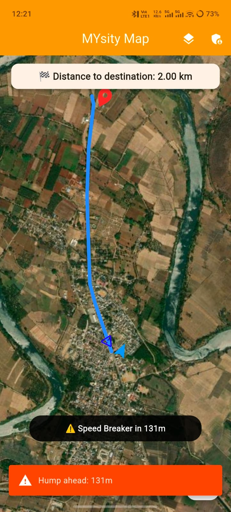
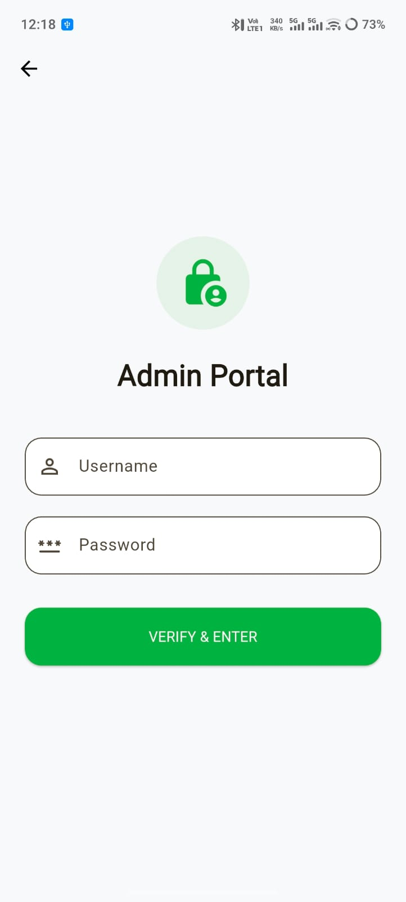

# 🚀 MYSITY MAP – Smart Road Safety Navigation for Mysore

**MYSITY MAP** is a location-based navigation application specifically engineered to enhance road safety in Mysore. By combining real-time GPS tracking with a crowdsourced/admin-managed database of speed breakers (humps), the app ensures drivers are never caught off guard.

---

## 📸 App Preview

| Splash & Login | Navigation Mode | Admin Portal |
| :---: | :---: | :---: |
|  |  |  |

---

## ✨ Key Features

### 🔐 Admin Portal
* **Secure Authentication:** Dedicated login for authorized personnel (e.g., city planners or moderators).
* **Live Data Management:** Admins can tap directly on the map to add, edit, or remove speed breaker coordinates in real-time.

### 🗺️ User Experience
* **Smart Navigation:** Seamless routing from your current location to any destination.
* **Live Distance Tracking:** High-precision GPS tracking to show exactly how far you are from your destination.
* **🔊 Voice Alerts:** Automatic Text-to-Speech (TTS) warnings: *“Hump ahead”* when the vehicle is within **150 meters**.
* **⚠️ Proximity Notifications:** Visual push notifications for an extra layer of safety.
* **Multi-Layer Maps:** Switch between **Normal**, **Satellite**, and **Hybrid** views.

---

## 🛠️ Tech Stack & Tools

* **Framework:** [Flutter](https://flutter.dev/) (High-performance Cross-platform UI)
* **Map Engine:** [OpenStreetMap (OSM)](https://www.openstreetmap.org/) via `flutter_map`
* **Backend:** [Firebase Cloud Firestore](https://firebase.google.com/) (Real-time data syncing)
* **Voice Engine:** `flutter_tts` for real-time audio safety cues.
* **Location:** `geolocator` for GPS services.

---

## 🚀 Future Roadmap
- [ ] **Real-time Traffic:** Integration with live traffic APIs.
- [ ] **Community Reporting:** Allow verified users to report new humps or potholes.
- [ ] **Offline Maps:** Navigation without a data connection.
- [ ] **Analytics Dashboard:** For city officials to see high-density hump areas.

---

## 🛠️ How to Run
1. Clone the repo: `git clone https://github.com/YOUR_USERNAME/mysity_map.git`
2. Run `flutter pub get`
3. Run `flutter run`
